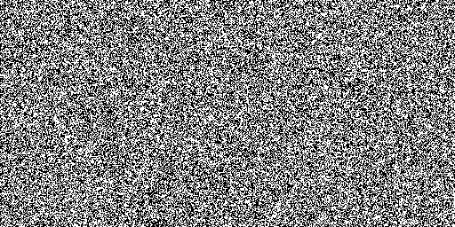
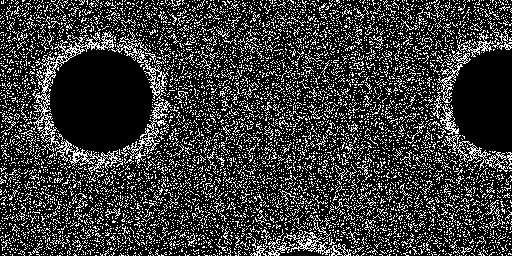

# CUDA Cellular Automata

*Requires the [CUDA Toolkit](https://developer.nvidia.com/cuda-downloads) to compile.*

This repository contains the code for an ongoing research project. Currently it has a library that is used to render cellular automata using CUDA C++.  
Included are several example programs that use the library.  

This project currently supports simple discrete MNCA. You can define your MNCA rules in a text file like [conway.txt](./resources/rules/conway.txt) and use them as the input for mnca_run.  

MNCA was developed by Slackermanz. For more information about MNCA or a brief explanation of cellular automata, check out [https://slackermanz.com](https://slackermanz.com/).

Example outputs:

  
_Conway's Game of Life_

  
_A discrete MNCA discovered by Slackermanz_
